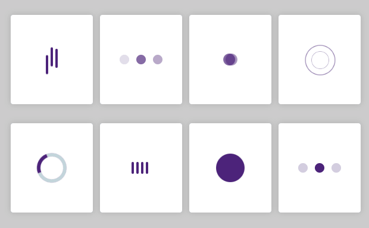

<h1 align='center'>
    
    <p>Loaders para utilizar / Laoder to use in projects</p>
</h1>
## ⛏ 

•Scss

## Contribue ♻
```bash
#Clone o projeto - Clone the project
$ git clone
```

```bash
#Install
$ npm install
```
<p align='center'> Or</p>

```bash
$ yarn


